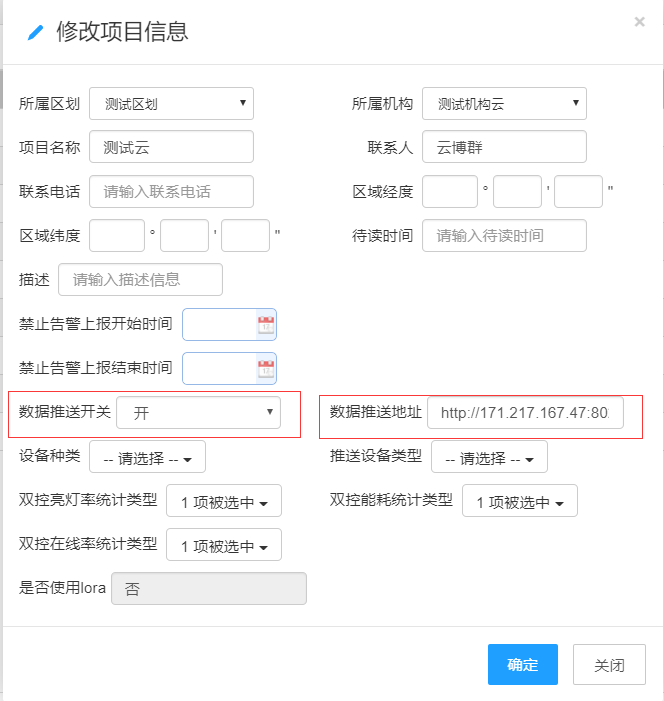

# 平台对接-紧急按键主动推送功能测试报告
- 数据推送测试地址：http://171.217.167.47:8021/ptService/sosData
- 服务器上报数据格式：
- 测试环境：http://192.168.30.2:8080/CloudPlatform 
## 1)设置推送开关与推送地址
- 测试账号：yunboqun 密码：87654321
- 
## 2)检查设备是否上线
- 测试账号：shiqi 密码：123456789
- 
## 3)测试设备数据是否上报
- 测试服务器：192.168.30.2
### 设备手动上报数据格式
```
{
    "platform":"23",
    "type":"1",
    "data":{
        "zsta":"1",
        "_addition":{
            "id":"5d09a3b3f22aff1b79515c2f",
            "time":"2019-07-05 13:39:50",
            "deviceType":123,
            "name":"一键告警",
            "address":"010100124b001586c9d9",
            "url":"http://171.217.167.47:8021/ptService/sosData",
            "msgType":"25"
        }
    }
}
```
### 平台推送手动上报数据返回
```
{"code": "200"}"
```
### 设备心跳包上传数据格式
```
{
    "platform":"23",
    "type":"1",
    "data":{
        "_addition":{
            "id":"5d09a3b3f22aff1b79515c2f",
            "time":"2019-07-05 13:39:50",
            "deviceType":123,
            "name":"一键告警",
            "address":"010100124b001586c9d9",
            "url":"http://171.217.167.47:8021/ptService/sosData",
            "msgType":"25"
        }
    }
}
```
### 心跳包数据返回
```
{"code": "200"}"
```
## 平台对接-紧急按键主动推送功能测试结果
| 测试总项 | 测试子项 | 测试步骤 | 预期结果 | 实际结果 | 
| ------ | ------ | ------ | ------ |  ------ | 
| 报警推送地址设置 | 项目添加--数据推送开 | 1、进入到项目机构--项目信息界面，点击添加，数据推送开关选择开，不填入数据推送地址，验证是否有错误提示 2、推送开关选择开，填入数据推送地址，验证项目能否添加成功，提示是否正确 | 1、当推送开关为开时，数据推送地址不填写，有错误提示2、项目可以正常添加，提示正确 | 1、当推送开关为开时，数据推送地址不填写，有错误提示 2、项目可以正常添加，但是无任何提示 | 
| 报警推送地址设置 | 项目修改 | 1、进入到项目机构--项目信息界面，选中一个项目，点击编辑，数据推送开关由开变成关，验证能否修改成功，提示正确 2、选中一个项目，点击编辑，数据推送开关由关变成开，不填入推送地址，验证是否有错误判断，提示正确 3、选中一个项目，点击编辑，数据推送开关由关变成开，填入推送地址，验证是能否修改成功，提示正确 | 开关可以正确修改成开或者关，提示正确，修改成开时，不填入推送地址有错误提示 | 开关可以正确修改成开或者关，提示正确，修改成开时，不填入推送地址有错误提示 | 
| 推送数据 | 手动触发紧急按钮触发推送数据 | 手动触发测试报警按钮，收到设备端上报的数据，并发给客户，收到正确返回 | 返回JSON格式数据，返回码为200 | 收到JSON格式数据，返回码为200 | 
## 平台对接-紧急按键主动推送功能测试总结
- 平台对接-紧急按键主动推送功能优化原先B/S端页面布局格式与校验，推送功能与客户联调结果通过。


